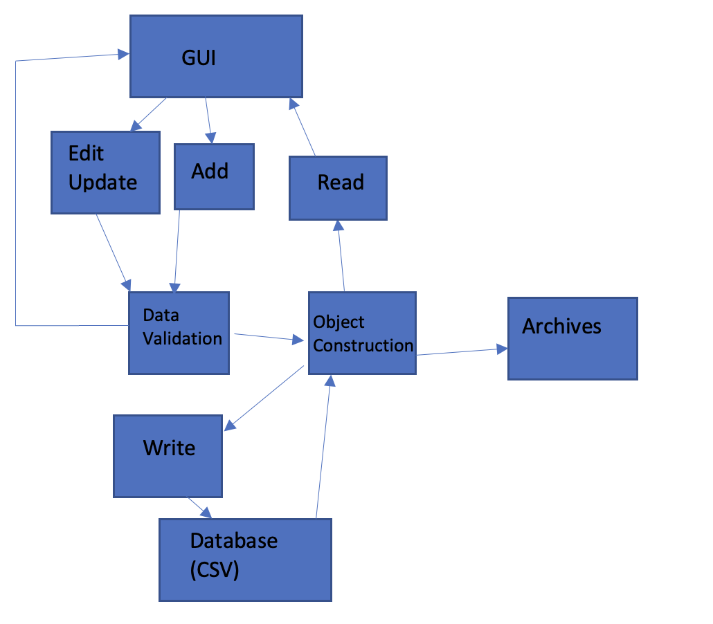

## Architecture

## [Problem Statement](https://diegomorales30.github.io/NullPointersWebsite/problem)
## [User Stories](https://diegomorales30.github.io/NullPointersWebsite/user)
## [Requirements](https://diegomorales30.github.io/NullPointersWebsite/requirements)
## [Architecture](https://diegomorales30.github.io/NullPointersWebsite/architecture)
## [Design Document](https://diegomorales30.github.io/NullPointersWebsite/designdocuments)
## [Test Report](https://diegomorales30.github.io/NullPointersWebsite/testreport)

## Project Overview

We are designing a system that will keep track of all patrons who utilize a free pet food distributor in order to assist in managing the supply. The system will be used to record new patrons and also update each patron as necessary. 

The ultimate goal is to make it simple to record, update and retrieve information on all patrons. 

## Architectural Drivers

Design: Intuitive and simple. 
    Should not require instructions, it should be obvious what each aspect will do.
Functional Requirements: Edit, save, archive, display. 
    The person using this software must have complete confidence that their data will be 
    recorded accurately and saved at all times.

## Possible Choices
Strategy Design Pattern:
Selects algorithm on runtime, which is useful when various algorithms are available but best algorithm isn’t known
For our application it can decide the best algorithm when the user is searching or inserting data
Pipes and Filter:
Since the crux of our software is essentially read/write methods, Pipes and Filter makes the most sense. 
Data will be sent to the CSV, filtered through the data validation. 
Data will be gathered from the CSV, and turned into owner objects.
Objects can then be accessed for data validation simply. 

## Chosen Architecture
Here is a simple graphic of our chosen architecture. 

## Conclusion
Pipes and Filters was chosen because it seems the most intuitive for a read/write/display software.
Drawback could be that pipes and filters isn’t great for an interactive system.

