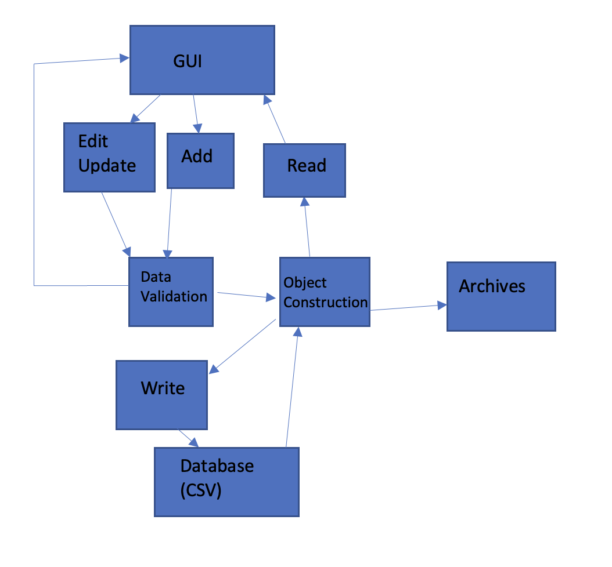

## Design Documents

## [Design Document](https://diegomorales30.github.io/NullPointersWebsite/designdocuments)
## [Back](https://diegomorales30.github.io/NullPointersWebsite/)

The design of our software is relatively simple. The person using our software should be able
to quickly and effectively search and edit their database of patrons. This is acheived by 
displaying the list of total patrons and narrowing it down based on searches. Once found, they 
can select the patron and edit their data.

The database is a CSV file, where each possible edit is filtered through data validation and 
errors are displayed if the entry is invalid. The major classes are Owners, Validation, and 
the JavaFx GUI. We are using a pipe and filter technique where the Owners are constructed from 
the CSV and validated, then displayed on the GUI. If an owner is to be edited, the change is filtered 
back to the CSV via data validation. The process is simple. 