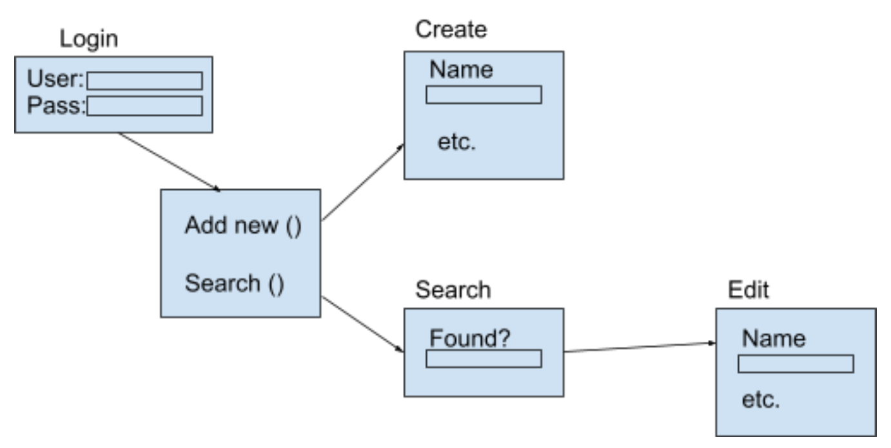

## Requirements
## [Requirements](https://diegomorales30.github.io/NullPointersWebsite/requirements)
## [Back](https://diegomorales30.github.io/NullPointersWebsite/)

1. Introduction
    1.1 Purpose of Product

    This software is a utility for a pet food distribution center. The 
    organization allows for low-income pet owners to recieve free pet food 
    and must manage how much food is allocated to individuals based on the 
    specifics of their pet and their need. We are creating both a database 
    to record the people who revieve food, as well as a simple UI to display, 
    change, and record the distribution to each individual.
    
    1.2 Scope of Product

    The scope is ostensibly small. We only need to record individuals and keep track 
    of ~5 data members per individual. However, the ultimate goal here is ease of use, 
    so a lot of our effort will be put into designing a smart and intuitive UI.
    
    1.3 Acronyms, Abbreviations, Definitions

    NULL

    1.4 References

    NULL

2. General Description of Product

    This product is a development tool that will be used to help a local animal shelter input and read data. The current system they have in place is not very user friendly and this app’s goal is to help the user input, store and read specific data which will lead to an overall optimization in the animal shelters data management.

    2.1 Context of Product

    The context that this product will be in is an app on a local desktop computer that only the admins have access to. Once prepared on the desktop, the app will be able to store past and new data coming into it.

    2.2 Domain Model 

    

    This domain model is a representation of the owner class. The owner class will first have to login and if the username and password is correct then they will either be able to add a new pet or search pets. From those options they will be taken to a creation block or search block which can be followed by editing. This is the basic concept of the owner class.
    
    2.3 Product Functions

    This product will be able to get user input and store that input into different classes such as owner or pets. These owner and pet classes will store this data and create the user to easily create or search for any specific data member.

    2.4 User Characteristics and Expectations

    The sole user is not assumed to be good at working on computers. Simple design is essential.

    2.5 Constraints

    Product is limited to time of submission, and it's limited to the abilities of the person who will use it, rather it should be simple since we should assume the person using it is not an intuitive software user. Some additional constraints on our system would include having multiple identifiers for data. When the users do a search for a specific owner and the data set has more than one person with the same name then we must have information to specify between the different data.

    2.6 Assumptions and Dependencies

    Our system will depend on a desktop computer that has the ability to download and run basic applications. Our application will be dependent on software such as javaFX to run and maintain the user interface. 

3. Functional Requirements
 [User Stories](https://diegomorales30.github.io/NullPointersWebsite/user)

4. System and Non-Functional Requirements

    4.1 External Interface Requirements 

    NF.4.1.1

    Person-machine interface. Customer will be interacting with software.

    NF.4.1.2

    CSV to UI.

            
    4.2 Performance Requirements

    NF.4.2.1

    Updated Windows or MacOs.

    4.3 Design Constraints

    NF.4.3.1

    UI must be efficent and not distracting. This means flashyness is not helpful. We 
    must be muted in our design choices, focus on intuitiveness. 

    4.4 Quality Requirements

    NF.4.4.1

    While non-life-critical, this product could have financial implications if it 
    does not work properly.

    NF.4.4.2

    Expected to be totally and completely accurate to the input of the person using 
    this software. 

    4.5 Other Requirements

    NF.4.5.1

    NULL
            

5. Appendices